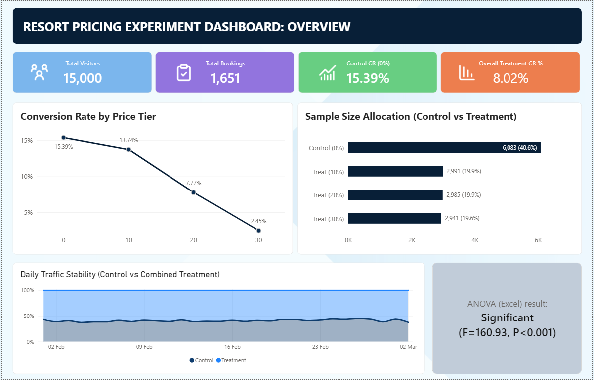
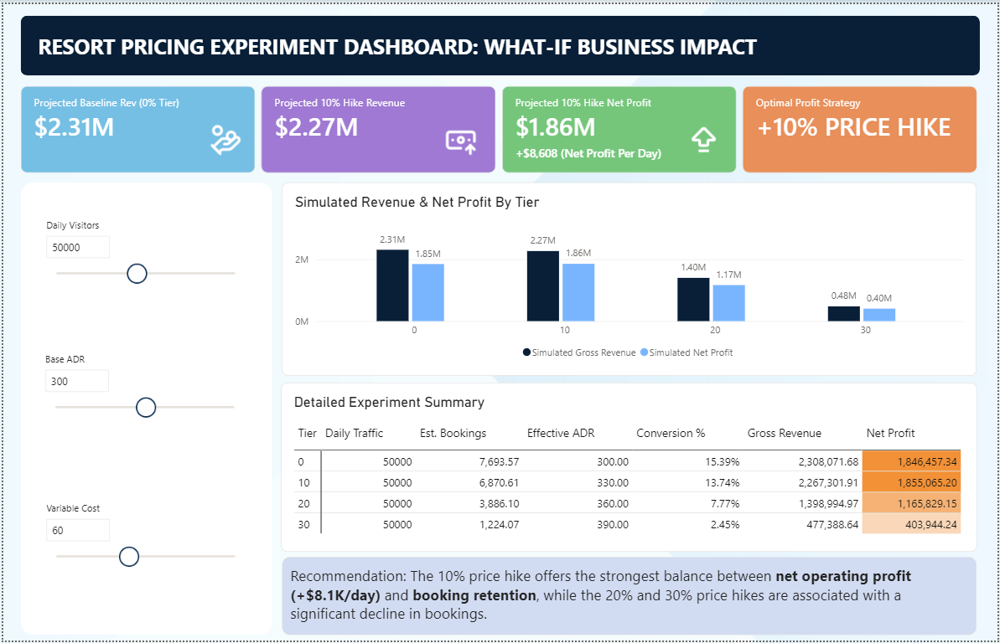

# Resort Pricing Experiment (A/B Test)

## Project Overview

This project analyses the impact of different resort room price increases on booking conversion and simulated net profit using an A/B testing approach.

Users were assigned to either a **Control** group, which saw the standard room price (0% increase), or a **Treatment** group, which saw an experimental price increase of 10%, 20%, or 30%.

The analysis evaluates booking conversion across price tiers, validates the experiment design, and uses scenario-based assumptions to simulate revenue and net profit outcomes. A Power BI dashboard was developed to help stakeholders explore the relationship between pricing, bookings, revenue, and profitability.

## Business Problem

The business needs to understand how different price increases affect customers' decision to complete a reservation after viewing the price.

The key business question is:

> How do 0%, 10%, 20%, and 30% price increases affect booking conversion and simulated net profit?

The analysis supports data-driven pricing decisions by comparing booking behaviour and simulated financial outcomes across different pricing scenarios.

## Business Objectives

- Compare booking conversion rates across different price increase levels.
- Analyse the Control group's conversion rate against the overall Treatment conversion rate.
- Validate the experiment design to identify potential sources of bias.
- Assess daily traffic stability across the experiment.
- Statistically test whether booking rates differ between price groups.
- Simulate revenue and net profit under different pricing scenarios.
- Provide business insights into the relationship between price increases, booking demand, and profitability.

## Data Dictionary

| Column | Description |
|---|---|
| `user_id` | Unique ID for the website visitor. Represents one unique session per day. |
| `date` | The date the user visited the resort website to search for availability. |
| `group` | **Control:** User saw the standard room price. **Treatment:** User was shown an experimental price increase. |
| `price_increase_pct` | Percentage increase applied to the base room price: 0% (Standard Price), 10% Price Hike, 20% Price Hike, or 30% Price Hike. |
| `booked` | **1 (Yes):** User successfully completed the reservation payment. **0 (No):** User viewed the price but abandoned the booking. |

## Tools & Technologies

- **Microsoft Excel** - Data cleaning, validation, descriptive statistics, and ANOVA
- **Power Query** - Data transformation
- **Power BI** - Interactive business impact dashboard
- **DAX** - KPI and analytical measure development
- **Star Schema** - Data modelling

## Data Analysis

### 1. Data Cleaning

The dataset was cleaned and prepared in Excel before analysis.

### 2. Experiment Validation

The Control and Treatment groups were validated to ensure the experiment design was unbiased. This included checking:

- Sample size allocation between Control and Treatment groups.
- Whether users were shown only one applicable price according to their assigned group.

These checks were performed to support reliable analysis of the experiment results.

### 3. Descriptive Statistics

Descriptive statistics were calculated for each group to understand the distribution of the data, including:

- Mean
- Median
- Standard deviation
- Kurtosis
- Skewness

### 4. ANOVA Testing

An ANOVA test was performed because the analysis compared more than two pricing groups.

The p-value was assessed against a significance level of **0.05** to determine whether there was a statistically significant difference between the groups.

### 5. Power BI Data Model

After the Excel cleaning and statistical analysis, the data was transformed using Power Query and structured into a **Star Schema data model** in Power BI.

DAX measures were developed to analyse:

- Total Visitors
- Total Bookings
- Overall Conversion Rate
- Control Conversion Rate
- Overall Treatment Conversion Rate

### 6. Scenario-Based Revenue & Profit Analysis

The dataset does not contain a room price (base ADR) or variable cost.

To support business scenario analysis, assumptions were made for:

- Base ADR
- Variable Cost
- Daily Visitors

These assumptions allow stakeholders to dynamically simulate revenue and net profit trade-offs across different price increase levels using What-If analysis.

## 📈 Dashboard Features

The Power BI dashboard provides an interactive view of:

- Control versus Treatment conversion performance.
- Booking conversion across 0%, 10%, 20%, and 30% price increases.
- Daily traffic stability.
- Total visitors and bookings.
- Simulated revenue across different pricing scenarios.
- Simulated net profit across different pricing scenarios.
- What-If analysis for daily visitors, base ADR, and variable cost.
- Revenue and profit trade-offs across different price tiers.
- Detailed experiment summary by pricing tier.

## Business Insights

Booking rates decline as price increases, from **15.39% at 0%** to **13.74% at 10%**, then dropping sharply to **7.77% at 20%** and **2.45% at 30%**. The **10% price hike** (assumed **$330 rate**) generates slightly lower gross revenue (**$2.267M vs $2.308M**) but **$8.1K higher net operating profit per day** (**$1.8549M vs $1.8468M**) due to lower servicing costs from **825 fewer occupied room nights**. Beyond 10%, the sharp decline in bookings reduces net profit by approximately **37% at 20% price hike** and **78% at 30% price hike**.

## Business Recommendations

The **10% price hike** offers the strongest balance between **booking retention** and **net operating profit (+$8.1K/day)**. **Implement the 10% price increase across resort listings** to maximise profitability while maintaining stronger booking demand than higher price tiers.

## Skills Demonstrated

- Data cleaning and preparation
- Experiment validation
- A/B testing analysis
- Descriptive statistics
- ANOVA hypothesis testing
- Power Query data transformation
- Star Schema data modelling
- DAX measure development
- Power BI dashboard development
- What-If scenario analysis
- Conversion rate analysis
- Revenue and profitability analysis
- Business insight generation
- Data-driven pricing analysis

## 📷 Dashboard Preview

### Experiment Overview

### What-If Business Impact

## 🎯 Project Outcome

The project demonstrates how A/B testing, statistical analysis, and interactive BI reporting can be combined to evaluate pricing decisions from both a **customer conversion** and **business profitability** perspective.

The analysis identified a clear decline in booking conversion as price increases became larger and used scenario-based revenue and profit analysis to evaluate the financial trade-offs between pricing and booking demand.

The resulting Power BI dashboard provides an interactive way for stakeholders to explore these pricing scenarios and understand their potential revenue and net profit impact.
